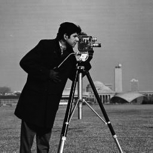
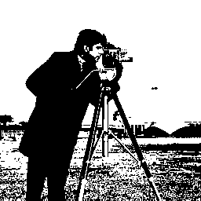
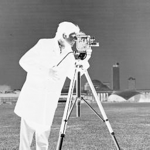
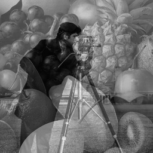
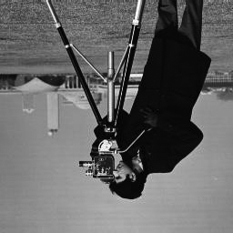
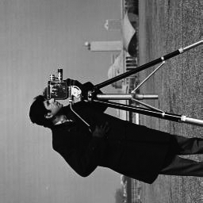
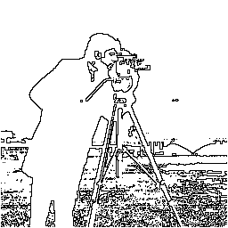
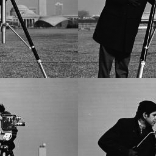
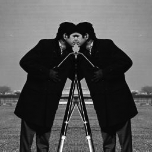

# Bmp Gray-Scale Image processing 256x256
## Faculty of Computers and Artificial Intelligence - Cairo University
This an educational project.

The program include 12 filters to edit bitmap gray scale images 256x256

**Original image:**

___________________________________________________________

**1 - Black and White**

___________________________________________________________

**2 - Invert**

___________________________________________________________

**3 - Merge**

___________________________________________________________

**4 - Flip**

* you can choose flip horizontal or vertical 

___________________________________________________________

**5 - Darken or Lighten**

* you can choose to darken or lighten

___________________________________________________________

**6 - Rotate**

* you can choose rotation degree

___________________________________________________________

**7 - Detect Edges**

___________________________________________________________

**8- Enlarge**

* the image unavailable :(

___________________________________________________________

**9 - Shrink**

___________________________________________________________

**a-  Mirror 1/2 Image**

* you can choose which half to mirror

___________________________________________________________

**b - Blur**

